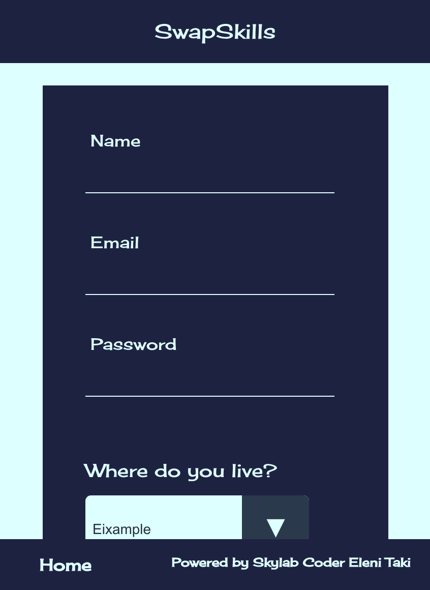

# SINGING-LAB

# 

## TARGET

This project is designed to help communities grow stronger and build ties between people in the neigbourhood. The target is to serve people´s needs easily and help create social bonds that contribute to better everyday life and the overall happiness of the individual.

## TECHNOLOGIES

| Transversal | Server-side | Client-side | Testing |
| :---------: |:-------: |:----------: |:---------: |
| Agile Methodology/Scrum | Node.js | React | Cypress |
| javascript (ES5, ES6) | firebase | SCSS |

- Other: [Trello](https://trello.com/b/W0oIqzno/swapskills), Git & Github, Sketch. 

## Functional description:

In this application users can signup introducing their name, email, a password of their choice, the area they live in (currently it includes only neighbourhoods in Barcelona), the skill/service they are willing to offer to the community as well as the service they need. Once logged in the user visits his profile page where he can edit the fields of area, skill and service they are interested in as well as find links to the skills page, the interests page and the statistics of the times they matched other people in the community. In the skills as well as in the interests page the user can see the neighbours that offer the service or require his skills and he can click yes or no. Yes will lead him to a new page that informs him if the neighbour has already matched him or not and will direct him to contact. No will delete the match from the database preventing the possibility of a supermatch.

### User Journeys

The following picture describes the different ways in which the user can interact with our project:

## Technical description:

### DATABASE MODEL

Below you can see the JSON structure of the two collections created in Firestore´s database.      

## DESIGN (screenshots)

### Home Page

### Login

### Register

### Profile

### Skills page

### Interests page

### Match statistics

### Supermatch

### Waiting

## PROJECT DEMO

You can see a demo of the project [here](https://swapskill-456e8.firebaseapp.com//)

## QR CODE

